# Stock Image Agent Lab Architecture

The application is organized around a central orchestration layer with specialist sub-agents. Each agent has a narrow contract, writes trace output, and contributes to the final readiness score.

```mermaid
flowchart LR
  U["User Prompt"] --> B["Central Brain"]
  B --> S["Scene Detail Agent"]
  S --> MB["Mood Board Agent"]
  MB --> P["Prompt Strategist"]
  P --> V["Visual Director"]
  V --> M["Market Analyst"]
  M --> C["Compliance Auditor"]
  C --> G["Image Generator"]
  G --> T["Technical Inspector"]
  T --> E["Metadata Editor"]
  E --> K["Packaging Agent"]
  K --> R["Readiness Result"]
  R --> I["Iteration Lab"]
  I --> B
```

## Core Contracts

- `GenerationRequest`: prompt, market, audience, style, aspect ratio, quality, mode, transparency, and optional mood board selection.
- `MoodboardPlan`: scene detail taxonomy, component matrix, reference assets, variation prompts, source notes, and warnings.
- `MoodboardDetailCategory`: grouped visual details such as characters, furniture, props, materials, lighting, color, and composition.
- `MoodboardSelection`: kept references, removed references, selected scene-detail briefs, variation prompt, and attribution data sent into the generation pipeline.
- `MarketplaceProfile`: platform eligibility, AI labeling requirement, format, megapixel range, file-size limit, keyword range, and metadata phrase policy.
- `AgentRun`: status, duration, score delta, notes, and structured outputs.
- `QualityGate`: pass/review/fail status with a numeric score and reviewer-readable detail.
- `StockMetadata`: title, description, keywords, category, release notes, and rejection risks.
- `ArtifactLinks`: image, ZIP package, metadata JSON, and readiness report.

## Production Extension Points

- Add provider-specific image search adapters beyond Openverse, with cost, license, and reliability scoring.
- Replace local heuristic metadata with a structured Responses API call.
- Move long-running generation to a queue with job polling.
- Split queues by cost profile: planning, generation, vision QA, postprocess, submission, and feedback.
- Add versioned JSON contracts for every agent input and output.
- Add image-similarity duplicate detection before package creation.
- Add visual QA through multimodal review before the final readiness gate.
- Store every agent trace in a database for evals and prompt regression tests.
